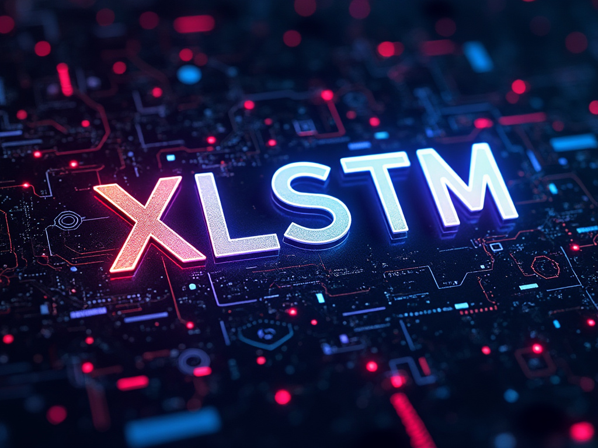

# xLSTM Resources

## About

This is a repository that contains resources about xLSTM, a new type of LSTM cell proposed by Sepp Hochreiter.

## Paper(s)

Here is the xLSTM paper:

- xLSTM: Extended Long Short-Term Memory, https://arxiv.org/abs/2405.04517

And here are other papers:

- [An Evaluation of Deep Learning Models for Stock Market Trend Prediction](https://arxiv.org/abs/2408.12408)
- [Vision-LSTM: xLSTM as Generic Vision Backbone](https://arxiv.org/abs/2406.04303)
- [xLSTMTime : Long-term Time Series Forecasting With xLSTM](https://arxiv.org/abs/2407.10240)

## Implementations

Here is a Hugging Face compatible (datasets, accelerate) implementation by yours truly:

- https://github.com/AI-Guru/helibrunna 

Here is the official implementation: 

- https://github.com/NX-AI/xlstm 

The first GitHub repositories that implement xLSTM are:

- https://github.com/andrewgcodes/xlstm 
- https://github.com/muditbhargava66/PyxLSTM 
- https://github.com/kyegomez/xLSTM 
- https://github.com/akaashdash/xlstm 
- https://github.com/myscience/x-lstm 
- https://github.com/dtunai/x-lstm-jax 
- https://github.com/abeleinin/mlx-xLSTM 

Thanks Bastian Best for the list!

## Videos

- xLSTM: Extended Long Short-Term Memory, Yannic Kilcher, https://www.youtube.com/watch?v=0OaEv1a5jUM
- xLSTM: The Sequel To The Legendary LSTM, bycloud, https://www.youtube.com/watch?v=7r1-4LDJDmM

## Resources

Here are some resources about xLSTM:

- NXAI: Sepp Hochreiter will europäische Antwort auf OpenAI erschaffen, Heise, https://www.heise.de/news/NXAI-Sepp-Hochreiter-will-europaeische-Antwort-auf-OpenAI-erschaffen-9618232.html
- Der Mann hinter Siri und Alexa: So plant er den nächsten Coup, Handelsblatt, https://www.handelsblatt.com/technik/ki/kuenstliche-intelligenz-der-mann-hinter-siri-und-alexa-so-plant-er-den-naechsten-coup/100011419.html
- Newsflash: Pierer invests Millions in Hochreiters XLSTM, Industrial AI Podcast, https://aipod.de/podcast-archive/230
- Millionen für neue KI-Architektur aus Europa, Tagesspiegel Background, https://background.tagesspiegel.de/digitalisierung/millionen-fuer-neue-ki-architektur-aus-europa
- The Challenger Aiming to Dethrone OpenAI’s LLM Supremacy: XLSTM, July 2023, https://www.analyticsvidhya.com/blog/2023/07/xlstm-to-take-down-openais-llm/
- "Wir werden das blöde GPT einfach wegkicken", WELT, https://www.welt.de/wirtschaft/plus247800674/Besseres-deutsches-Google-Wir-werden-das-bloede-GPT-einfach-wegkicken.html?notify=success_subscription
- xLSTM - "I am almost exploding", Industrial AI Podcast, October 2023, https://www.youtube.com/watch?v=hwIt7ezy6t8
- Deutscher KI-Pionier fordert US-Branchengrößen heraus, Manager Magazin, February 2024, https://www.manager-magazin.de/unternehmen/tech/sepp-hochreiter-gruendet-start-up-nxai-deutscher-ki-pionier-fordert-us-branchengroessen-heraus-a-6fcc41f8-3da6-4d16-a229-d9ab44cf73bd
- Europäisches Large Language Model, PCtipp, February 2024, https://www.pctipp.ch/news/kuenstliche-intelligenz/europaeisches-large-language-model-2908536.html
- NXAI: AI-Experte Sepp Hochreiter gründet neues KI-Startup, Brutkasten, February 2024, https://brutkasten.com/artikel/nxai-ai-experte-sepp-hochreiter-gruendet-neues-ki-startup
- Hochreiter und Pierer wollen besseres ChatGPT entwickeln, Factory, February 2024, https://factorynet.at/branche/hochreiter-und-pierer-wollen-besseres-chatgpt-entwickeln/
- Hochreiter: „ChatGPT ist ein Schmarrn. Wir schlagen alles, was am Markt ist“, Kurier AT, February 2024, https://kurier.at/chronik/oberoesterreich/hochreiter-chatcpt-ist-ein-schmarrn-wir-schlagen-alles-was-am-markt-ist/402780517
- 244: The xLSTM paper and a gripper, The Industrial AI Podcast, May 2024 https://aipod.de/the-xlstm-paper-and-a-gripper/
Deutscher KI-Pionier entwickelt schlanke LLM-Alternative, BigData Insider, February 2024, https://www.bigdata-insider.de/deutscher-ki-pionier-entwickelt-schlanke-llm-alternative-a-d0847f49b169cc7378edae12554c4003/
- xLSTM : A Comprehensive Guide to Extended Long Short-Term Memory, Unite.AI, May 2024, https://www.unite.ai/xlstm-a-comprehensive-guide-to-extended-long-short-term-memory/
- LSTMs Rise Again: Extended-LSTM Models Challenge the Transformer Superiority, KDnuggets, May 2024, https://www.kdnuggets.com/lstms-rise-again-extended-lstm-models-challenge-the-transformer-superiority?utm_source=rss&utm_medium=rss&utm_campaign=lstms-rise-again-extended-lstm-models-challenge-the-transformer-superiority

## Tristans Posts

### LinkedIn

- https://www.linkedin.com/feed/update/urn:li:activity:7160164587886039041/
- https://www.linkedin.com/feed/update/urn:li:activity:7117918611272257536/
- https://www.linkedin.com/in/dr-tristan-behrens-734967a2/recent-activity/all/
- https://www.linkedin.com/posts/dr-tristan-behrens-734967a2_i-am-listening-to-the-industrial-ai-podcast-activity-7193837406150623232-aNlQ
- https://www.linkedin.com/posts/dr-tristan-behrens-734967a2_the-xlstm-paper-is-here-you-might-want-to-activity-7193836745107357696-N0Jz
- https://www.linkedin.com/posts/dr-tristan-behrens-734967a2_open-source-xlstm-it-has-begun-people-have-activity-7194207145863663616-1VkA
